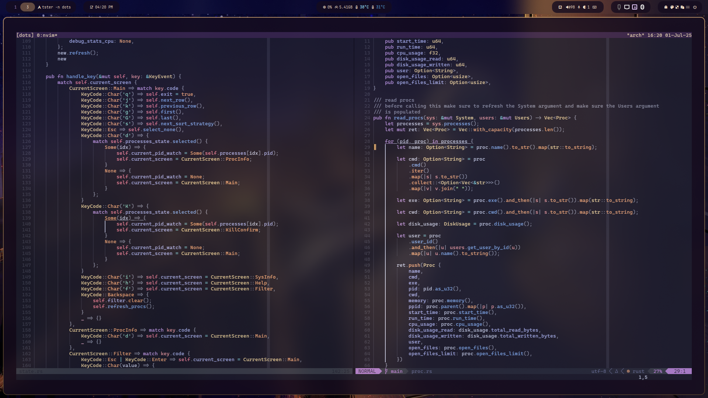
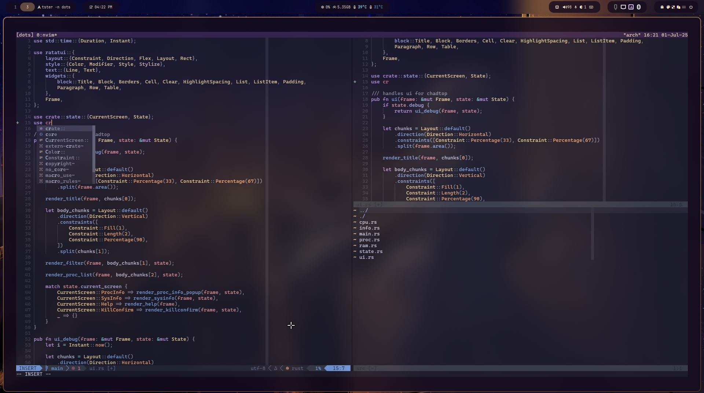
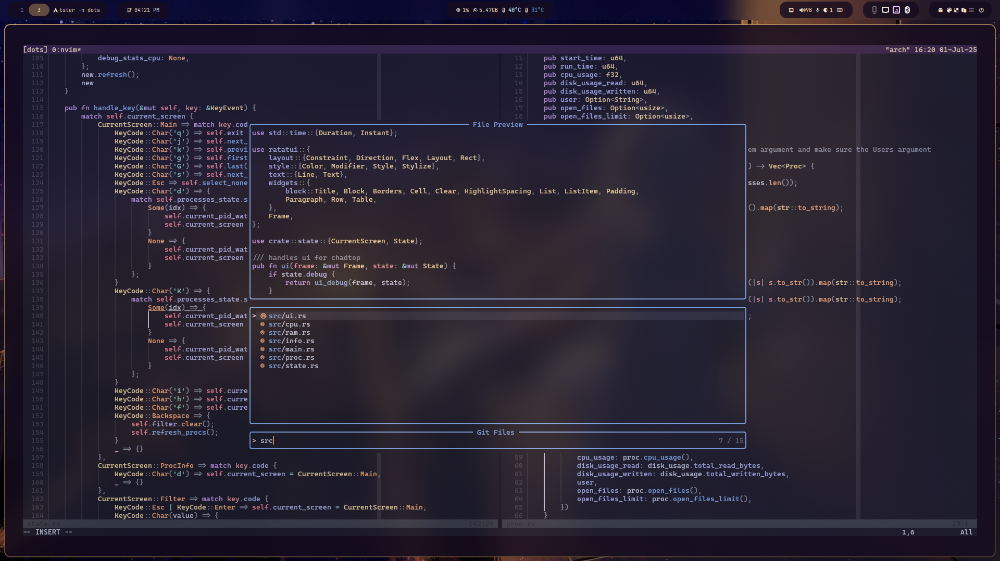

# ethanrutt nvim config
This is a simple, minimal neovim config that gets the job done. It's meant to
not get in your way and have everything at your fingertips.

## Core Plugins
- Lazy package manager
- Telescope
- Treesitter
- Mason
- blink.cmp

## Theming
- catppuccin mocha
- lualine

## Util
- autopairs and autotag
- whitespace
- which-key

## Images

