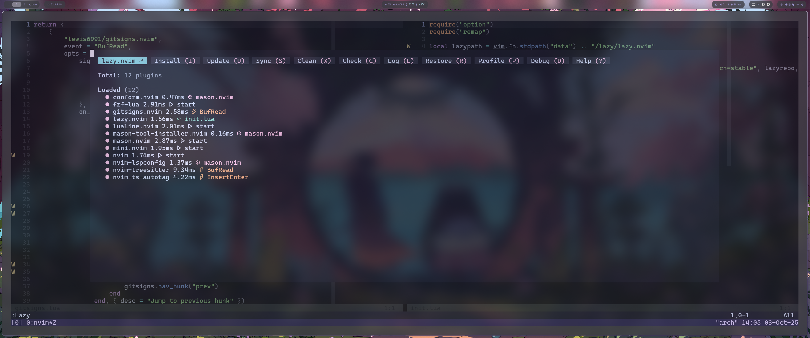

# ethanrutt nvim config
This is a simple, minimal neovim config that gets the job done. It's meant to
not get in your way and have everything at your fingertips.

## Core Plugins
- Lazy package manager
- fzf-lua
- Treesitter
- Mason

## Theming
- catppuccin mocha
- lualine

## Util
- mini utils
    - surround
    - pairs
    - trailspace
- autotag
- gitsigns
- conform

## Images

